---
## Front matter
author:
  name: Гибадуллин Адель Альмирович
  email: 1132250403@rudn.ru
  affiliation:
    - name: Российский университет дружбы народов
      country: Российская Федерация
      postal-code: 117198
      city: Москва
      address: ул. Миклухо-Маклая, д. 6
      
title: "Отчёт по этапу индивидуального проекта №1"
subtitle: "Операционные системы"

## Generic options
lang: ru-RU
toc-title: "Содержание"

## Pdf output format
toc: true
toc-depth: 2
lof: true
lot: true
fontsize: 12pt
linestretch: 1.5
papersize: a4
documentclass: scrreprt
## I18n polyglossia
polyglossia-lang:
  name: russian
  options:
	- spelling=modern
	- babelshorthands=true
polyglossia-otherlangs:
  name: english
## I18n babel
babel-lang: russian
babel-otherlangs: english
## Fonts
mainfont: PT Serif
romanfont: PT Serif
sansfont: PT Sans
monofont: PT Mono
mainfontoptions: Ligatures=TeX
romanfontoptions: Ligatures=TeX
sansfontoptions: Ligatures=TeX,Scale=MatchLowercase
monofontoptions: Scale=MatchLowercase,Scale=0.9
## Biblatex
biblatex: true
biblio-style: "gost-numeric"
biblatexoptions:
  - parentracker=true
  - backend=biber
  - hyperref=auto
  - language=auto
  - autolang=other*
  - citestyle=gost-numeric
## Pandoc-crossref LaTeX customization
figureTitle: "Рис."
tableTitle: "Таблица"
listingTitle: "Листинг"
lofTitle: "Список иллюстраций"
lotTitle: "Список таблиц"
lolTitle: "Листинги"
## Misc options
indent: true
header-includes:
  - \usepackage{indentfirst}
  - \usepackage{float}
  - \floatplacement{figure}{H}
---

# Цель работы

Научиться размещать сайт на Github pages. Выполнить первый этап реализации индивидуального проекта.

# Задание

1. Установить необходимое программное обеспечение.
2. Скачать шаблон темы сайта.
3. Разместить его на хостинге Git.
4. Установить параметр для URLs сайта.
5. Разместить заготовку сайта на Github pages.

# Теоретическое введение

Hugo --- генератор статических сайтов, написанный на языке Go. Он позволяет создавать быстрые и современные веб-сайты из файлов в формате Markdown. В данной работе используется тема Hugo Academic (Wowchemy), предназначенная для создания персональных академических страниц.

GitHub Pages --- бесплатный хостинг для статических сайтов, интегрированный с GitHub. Деплой сайта осуществляется автоматически через GitHub Actions при каждом push в репозиторий.

| Инструмент | Назначение |
|------------|-----------|
| Hugo Extended | Генератор статических сайтов с расширенной поддержкой SCSS |
| Go | Язык программирования, необходимый для работы Hugo-модулей |
| Git | Система контроля версий для работы с репозиториями |
| GitHub Pages | Хостинг для размещения статического сайта |
| GitHub Actions | Автоматическая сборка и деплой сайта при каждом push |

: Основные инструменты, используемые в работе {#tbl:tools}

# Выполнение этапа индивидуального проекта

## Установка необходимого ПО

Обновляю список пакетов с помощью команды `sudo apt update` (рис. @fig:001).

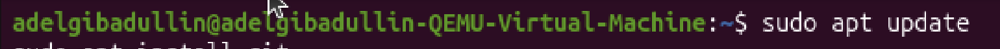{#fig:001 width=70%}

Устанавливаю систему контроля версий Git с помощью команды `sudo apt install git` (рис. @fig:002).

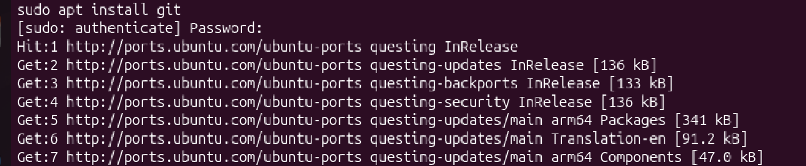{#fig:002 width=70%}

Устанавливаю язык программирования Go, необходимый для работы Hugo-модулей, с помощью команды `sudo apt install golang-go -y` (рис. @fig:003).

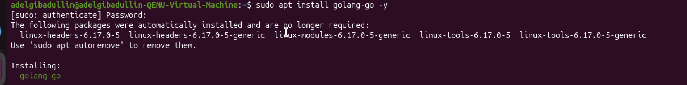{#fig:003 width=70%}

Устанавливаю Hugo Extended через snap: `sudo snap install hugo --channel=extended`. Именно версия Extended необходима для корректной работы темы Hugo Academic (рис. @fig:004).

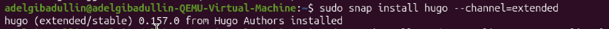{#fig:004 width=70%}

## Скачивание шаблона темы сайта

Открываю репозиторий с шаблоном темы сайта Hugo Academic (starter-hugo-academic) на GitHub. Нажимаю кнопку «Use this template» для создания собственного репозитория на основе шаблона (рис. @fig:005).

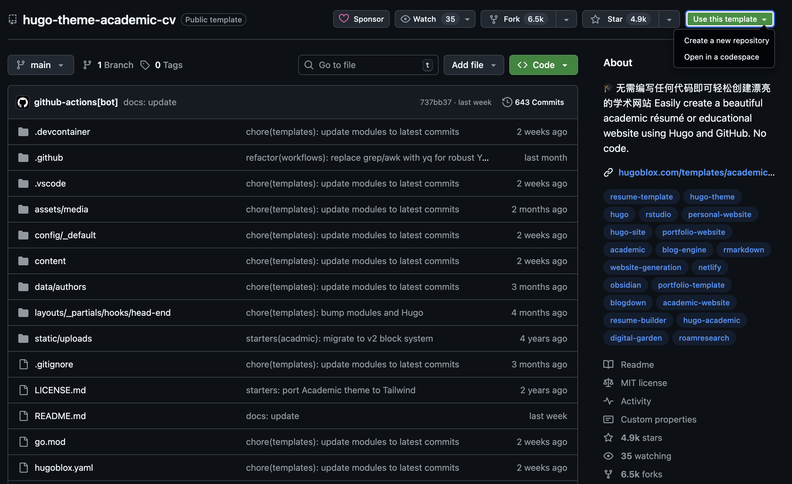{#fig:005 width=70%}

Создаю свой репозиторий blog на основе шаблона, выбираю тип Public (рис. @fig:006).

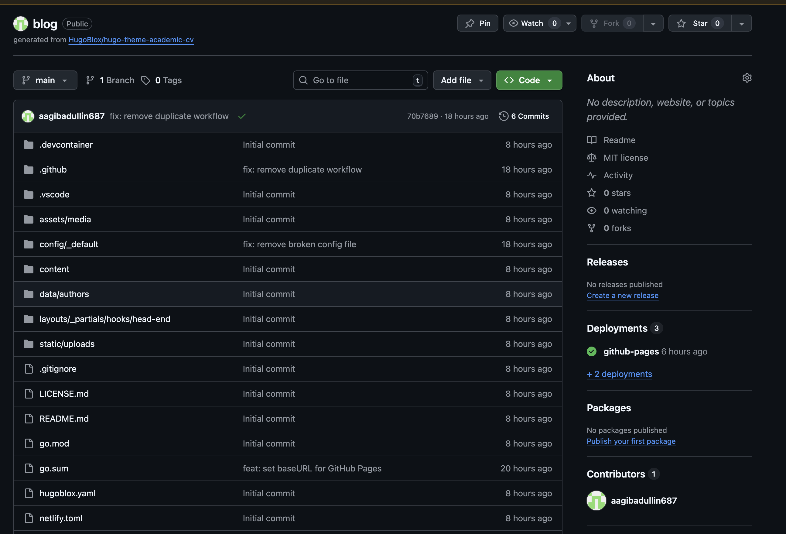{#fig:006 width=70%}

Клонирую созданный репозиторий к себе в локальный каталог с помощью команды `git clone` (рис. @fig:007).

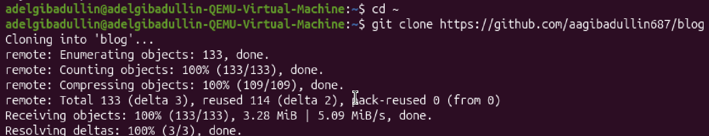{#fig:007 width=70%}

## Размещение на хостинге Git

Перехожу в каталог blog и запускаю `hugo server` для проверки работоспособности сайта на локальном сервере (рис. @fig:008).

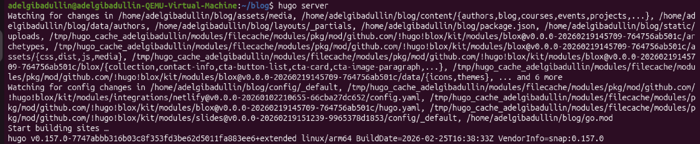{#fig:008 width=70%}

Открываю браузер и перехожу по адресу `http://localhost:1313/blog/`. Сайт успешно отображается на локальном сервере (рис. @fig:009).

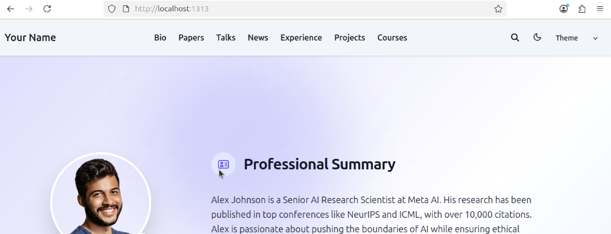{#fig:009 width=70%}

## Установка параметра для URLs сайта

Открываю файл конфигурации `config/_default/hugo.yaml` с помощью текстового редактора nano и устанавливаю параметр baseURL равным `https://aagibadullin687.github.io/blog/`, чтобы сайт корректно работал на GitHub Pages (рис. @fig:010).

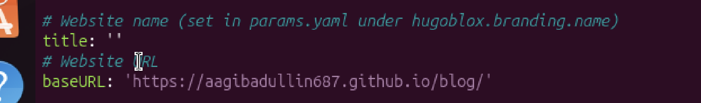{#fig:010 width=70%}

## Размещение заготовки сайта на Github Pages

Отправляю все изменения на GitHub с помощью команд `git add .`, `git commit` и `git push` (рис. @fig:011).

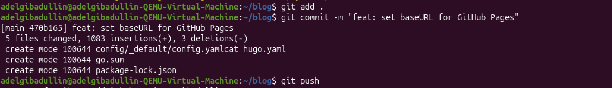{#fig:011 width=70%}

Перехожу во вкладку Actions на GitHub. GitHub Actions автоматически выполняет сборку и деплой сайта. Процесс завершается успешно --- появляется зелёная галочка (рис. @fig:012).

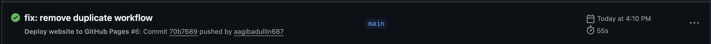{#fig:012 width=70%}

Открываю браузер и перехожу по адресу `https://aagibadullin687.github.io/blog/`. Сайт успешно развёрнут и доступен из интернета (рис. @fig:013).

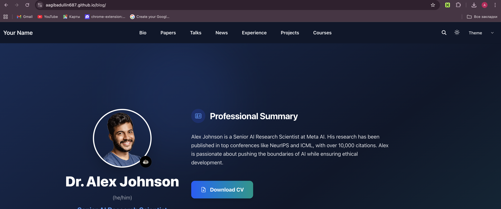{#fig:013 width=70%}

# Выводы

В ходе выполнения первого этапа индивидуального проекта было установлено необходимое программное обеспечение (Hugo Extended, Go, Git), создан репозиторий blog на основе шаблона Hugo Academic, настроен параметр baseURL и выполнен деплой сайта на GitHub Pages. Сайт успешно доступен по адресу `https://aagibadullin687.github.io/blog/`.

